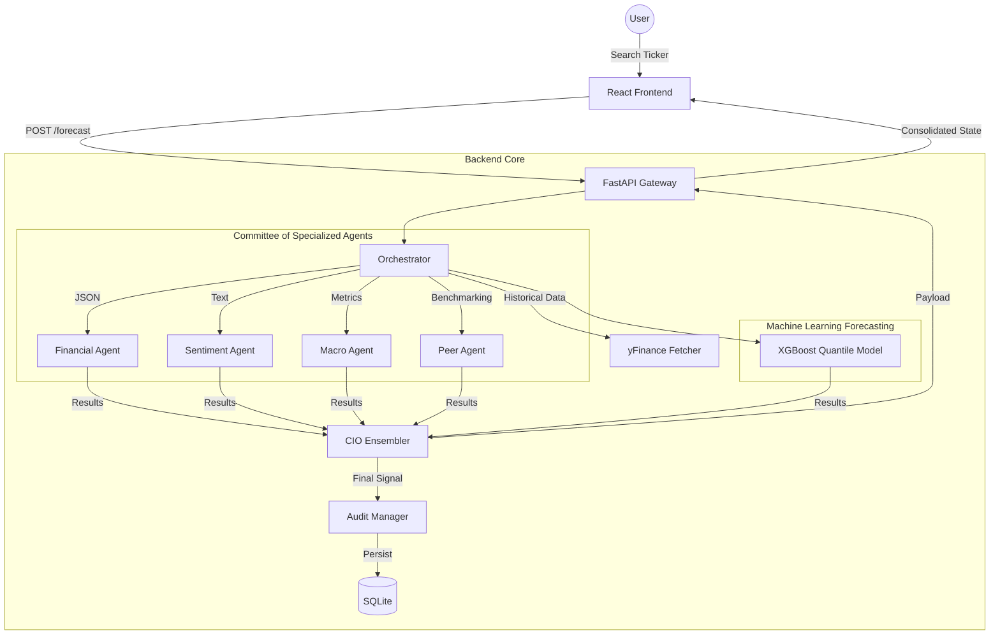

# 🦅 FinSage AI — **The Professional Multi-Agent Financial Intelligence Platform**

[](#-tech-stack-summary)
[](#-llm-client-rotation)
[](#-full-system-architecture)

> **FinSage AI** is a state-of-the-art financial synthesis engine. It bridges the gap between raw quantitative market data and qualitative narrative sentiment by orchestrating a **Committee of Specialized AI Agents**. Every signal is ensembled by a "CIO Agent" and backed by a transparent, immutable audit trail.

---

## 📋 Table of Contents
1.  [🚀 What Is FinSage AI?](#-what-is-finsage-ai)
2.  [🧑‍💻 Who Is This For?](#-who-is-this-for)
3.  [🖼️ Live Demo Interface](#️-live-demo-interface)
4.  [🏗️ Full System Architecture](#️-full-system-architecture)
5.  [🧪 Phase 0: Offline Training & Training Pipeline](#-phase-0-offline-training--training-pipeline)
6.  [📥 Phase 1: User Request Entry](#-phase-1-user-request-entry)
7.  [🛣️ Phase 2: Orchestrator & Data Routing](#️-phase-2-orchestrator--data-routing)
8.  [🧠 Phase 3: The 4 Parallel AI Agents](#-phase-3-the-4-parallel-ai-agents)
    *   [📊 Financial Agent](#-financial-agent)
    *   [🎭 Sentiment Agent](#-sentiment-agent)
    *   [🌎 Macro Agent](#-macro-agent)
    *   [🏁 Peer Agent](#-peer-agent)
9.  [🗳️ Phase 4: Ensembler (Chief Investment Officer)](#️-phase-4-ensembler-chief-investment-officer)
10. [📂 Phase 5: Response Assembly & Audit Trail](#-phase-5-response-assembly--audit-trail)
11. [📁 Project File Structure (Exhaustive)](#-project-file-structure-exhaustive)
12. [💻 Frontend Walkthrough](#-frontend-walkthrough)
13. [🔌 LLM Client Rotation & Fallback Logic](#-llm-client-rotation--fallback-logic)
14. [📉 Data Sources Explained](#-data-sources-explained)
15. [🔑 Environment Variables & Configuration](#-environment-variables--configuration)
16. [🛠️ How to Run Locally (Step-by-Step)](#️-how-to-run-locally-step-by-step)
17. [📡 API Reference](#-api-reference)
18. [🗄️ Database Schema](#️-database-schema)
19. [🛠️ Tech Stack Summary](#️-tech-stack-summary)
20. [⚠️ Known Limitations & Future Roadmap](#️-known-limitations--future-roadmap)
21. [⚡ Quick Reference Card (Dev Cheatsheet)](#-quick-reference-card-dev-cheatsheet)

---

## 🚀 1. What Is FinSage AI?

FinSage AI solves the **"Analysis Fragmentation"** crisis in modern finance. While traders are traditionally divided into "Quants" (numbers) and "Technical/Sentiment" (narrative) schools, FinSage AI synthesizes both using a **Multi-Agent Committee (MAC)** architecture.

### **The Core Problem**
In current markets, raw data is abundant but **high-signal insight** is scarce. 
*   **Information Overload:** A single ticker generates thousands of news items, social posts, and SEC filings daily.
*   **Siloed Intelligence:** Quantitative models ignore human narrative; LLMs ignore strict solvency ratios.
*   **Black-Box Decisions:** Most AI trading signals lack "Explainability"—you don't know *why* it says 'Buy'.

### **How We Solve It**
FinSage AI runs four specialized agents in parallel. Each agent is "blind" to the others until the final **Ensembling Phase**, preventing bias and ensuring a diverse range of perspectives—identical to an institutional investment committee.

---

## 🧑‍💻 2. Who Is This For?
*   **Professional Quantitative Analysts:** A framework to integrate LLM logic with XGBoost forecasting.
*   **Portfolio Managers:** A second-opinion tool that summarizes news into sentiment polarity.
*   **FinTech Developers:** A production-ready blueprint for multi-agent LLM orchestration.
*   **Retail Investors:** Access to high-level institutional-grade committee analysis.

---

## 🖼️ 3. Live Demo Interface
```ascii
+-----------------------------------------------------------+
| 🦅 FINSAGE AI | DASHBOARD | Ticker: NVDA | Signal: BUY    |
+-----------------------------------------------------------+
| [ REVENUE FORECAST (XGBOOST) ]                            |
|  $30B |                                                   |
|       |             ○ <- [Predicted Range: $28B-$31B]     |
|  $20B |       ●-----'                                     |
|       | ○-----'                                           |
|       +--------------------------------------------> Time |
|         Q1    Q2    Q3    Q4 (Forecast)                   |
+-----------------------------------------------------------+
| [ COMMITTEE INSIGHTS ]                                    |
| 📊 FINANCIAL: "ROE increased by 12%; Debt Coverage 4x"    |
| 🎭 SENTIMENT: "Social buzz 8.2/10; News cycle Bullish"    |
| 🌎 MACRO:     "Rate cuts expected; Tech sector tailwind"  |
| 🏁 PEER:      "Gaining 4% market share from Intel/AMD"    |
+-----------------------------------------------------------+
| [ CIO REASONING ]                                         |
| "Consensus reached on growth persistence vs macro risk."  |
| CONFIDENCE: 89.2% | AUDIT ID: #AX-9012                    |
+-----------------------------------------------------------+
```

---

## 🏗️ 4. Full System Architecture

### **Modular Data Flow**


---

## 🧪 5. Phase 0: Offline Training & Training Pipeline
Before the first user request, the system must calibrate its statistical "brain".
1.  **Synthetic Financial Generation (`generator.py`):** Uses **Geometric Brownian Motion (GBM)** to simulate price paths and **Auto-Regressive (AR1)** models to generate synthetic fundamental ratios. This allows the model to learn from "Market Crash" scenarios that haven't happened yet.
2.  **Feature Store (`feature_store.py`):** Transforms raw OHLCV and fundamental data into **Alpha Features** (Rolling Volatility, RSI, Debt-to-Equity lags).
3.  **XGBoost Training (`xgboost_model.py`):** Trains a **Quantile Regressor**. Unlike standard regression which gives one number, quantile regression provides the **lower bound (P10)** and **upper bound (P90)** of potential revenue, allowing for risk-aware forecasting.

---

## 📥 6. Phase 1: User Request Entry
1.  User enters a ticker (e.g., `NVDA`) on the Home Page.
2.  The `useForecast` React hook validates the ticker string.
3.  An asynchronous POST request is dispatched to the backend.
4.  A **Loading Spinner** is rendered, displaying status messages such as "Syncing with Committee..." to maintain user engagement.

---

## 🛣️ 7. Phase 2: Orchestrator & Data Routing
The `orchestrator.py` is the conductor of the system.
*   **Asynchronous Parallelism:** It utilizes `asyncio.gather()` to trigger all 4 agents and the ML model simultaneously.
*   **Data Slicing:** Instead of sending the entire 10-year history to every agent, it slices data according to need:
    *   **Financial Agent:** Gets 4 years of Balance Sheets/Income Statements.
    *   **Sentiment Agent:** Gets the last 30 days of news headlines.
    *   **Macro Agent:** Gets sector-wide CPI and interest rate trends.
    *   **Peer Agent:** Gets a list of top-5 competitors and their market share.

---

## 🧠 8. Phase 3: The 4 Parallel AI Agents

### **📊 Financial Agent**
*   **Core Task:** Evaluate the "Intrinsic Strength" of the company.
*   **Logic:** Calculates Altmans-Z Score, ROE, Current Ratio, and Debt-to-Equity.
*   **LLM Prompting:** Structured to think as a CPA/CFA.
*   **Degraded Mode:** If LLM fails, it falls back to a hard-coded Python rule-engine (Ratios > Threshold = "HEALTHY").

### **🎭 Sentiment Agent**
*   **Core Task:** Gauge "Market Mood".
*   **Input:** Multi-provider news scrapers.
*   **Logic:** Summarizes qualitative news into a polarity score (-1.0 to 1.0).
*   **Timeout Handling:** Uses Gemini 1.5 Flash for high context windows if news volume is high.

### **🌎 Macro Agent**
*   **Core Task:** Contextualize the ticker in the "Big Picture".
*   **Logic:** Analyzes if current Federal Reserve policy acts as a "tail-wind" or "head-wind" for the ticker's specific sector.
*   **Fallback:** Uses a static sector-mapping table.

### **🏁 Peer Agent**
*   **Core Task:** Benchmarking.
*   **Logic:** Compares the ticker's PEG ratio and revenue growth against its 3 closest rivals.
*   **Output:** A "Winner/Laggard" assessment.

---

## 🗳️ 9. Phase 4: Ensembler (Chief Investment Officer)
The **CIO Agent** acts as the "Adult in the Room".
*   **Input:** Receives 4 JSON objects from the agents + 1 Forecast from XGBoost.
*   **Consensus Logic:** It checks for "Consensus vs Divergence". 
    *   *Example:* If Financials are great but Sentiment is terrible, the CIO notes the "Value Trap" risk and downgrades the signal to **HOLD**.
*   **Final Output:** A single `{ "signal": "BUY", "confidence": 0.85, "reasoning": "..." }` packet.

---

## 📂 10. Phase 5: Response Assembly & Audit Trail
1.  **Persistence (`audit/db.py`):** The final ensemble, agent logs, and timestamps are saved to `audit_trail.sqlite`. This ensures that in 6 months, you can check *exactly* why the AI recommended a trade.
2.  **Assembly:** All agent data is packed into a nested JSON structure.
3.  **Delivery:** The frontend receives the payload and re-renders the **Results Page**.

---

## 📁 11. Project File Structure (Exhaustive)

```ascii
finsage-ai/
│
├── README.md                          # 📖 Detailed documentation (this file)
├── .gitignore                         # 🙈 Git ignore rules for node, venv, .env
│
├── backend/                           # ⚙️ Python Multi-Agent Backend
│   ├── .env                           # 🔑 API Keys (Groq, Gemini)
│   ├── requirements.txt               # 📦 Core Python dependencies
│   ├── config.yaml                    # ⚙️ Global thresholds & LLM timeouts
│   ├── train_pipeline.py              # 🚀 Entry: Pipeline orchestrator
│   │
│   ├── out/                           # 🧊 ML Binary Artifacts (Git Ignored)
│   │   ├── financial_model.pkl        #   - Trained XGBoost model
│   │   └── features.json              #   - Feature metadata
│   │
│   ├── agents/                        # 🧠 The Committe of AI Agents
│   │   ├── base.py                    #   - Abstract Base Agent class
│   │   ├── financial_agent.py         #   - Quant Financial Analysis
│   │   ├── sentiment_agent.py         #   - News/NLP Analysis
│   │   ├── macro_agent.py             #   - Macroeconomic context
│   │   └── peer_agent.py              #   - Competitor benchmarking
│   │
│   ├── orchestrator/                  # 🚦 Workflow & Communication
│   │   ├── api.py                     #   - FastAPI Routes & App entry
│   │   ├── orchestrator.py            #   - Parallel execution manager
│   │   └── ensembler.py               #   - CIO Agent (Signal merging)
│   │
│   ├── models/                        # 📉 Predictive Statistical Models
│   │   └── xgboost_model.py           #   - XGBoost Train/Predict logic
│   │
│   ├── data/                          # 📡 Data Acquisition
│   │   └── yfinance_fetcher.py        #   - Live Yahoo Finance adapter
│   │
│   ├── llm/                           # 🔌 LLM Connectivity
│   │   └── client.py                  #   - Groq/Gemini rotation logic
│   │
│   └── audit/                         # ⚖️ Governance & Accountability
│       ├── db.py                      #   - SQLAlchemy Trace Schema
│       └── audit_trail.sqlite         #   - Local Audit DB (Auto-created)
│
└── frontend/                          # 🎨 Modern React Dashboard
    ├── package.json                   # 📦 React + Vite dependencies
    ├── vite.config.js                 # ⚡ Build configuration
    ├── index.html                     # 📄 Main entry point (HTML5)
    │
    └── src/                           # ⚛️ Source Code
        ├── main.jsx                   #   - React Bootstrap
        ├── App.jsx                    #   - Main Routing & Navigation
        ├── index.css                  #   - Styling & Design Tokens
        │
        ├── pages/                     # 📄 View Components
        │   ├── Home.jsx               #   - Search & Market Pulse
        │   ├── Results.jsx            #   - Analysis Visualization
        │   └── Audit.jsx              #   - Historical Log Viewer
        │
        ├── components/                # 🧩 Reusable Atomic UI
        │   ├── AgentCard.jsx          #   - Individual Agent Insight UI
        │   ├── ForecastChart.jsx      #   - Recharts Real-time graph
        │   ├── SignalBadge.jsx        #   - Score & Confidence badge
        │   └── LoadingSpinner.jsx     #   - Engagement component
        │
        ├── hooks/                     # 🎣 React Logic
        │   └── useForecast.js         #   - API Fetching & State
        │
        └── utils/                     # 🛠️ Helper Functions
            └── formatters.js          #   - Currency & Percent logic
```

---

## 💻 12. Frontend Walkthrough

### **🚀 The Search (Home.jsx)**
*   Large, centered input with focus-glow effects.
*   One-click "Quick Select" for major tickers (NVDA, BTC, AAPL).
*   **Design:** Deep slate background with vibrant blue primary accents.

### **📊 The Dashboard (Results.jsx)**
*   **Header Section:** Ticker badge + Final Signal + Confidence progress bar.
*   **Forecast Section:** Interactive line chart mapping historical revenue against the AI-predicted range.
*   **Reasoning Section:** A combined summary from the CIO Agent explaining the consensus.
*   **Agent Grid:** 4 cards showing individual agent findings and raw data flags.

---

## 🔌 13. LLM Client Rotation & Fallback Logic
We minimize API downtime using a **Tiered Logic Client**:
1.  **Tier 1: Groq (Llama 3 70b):** Used for intensive reasoning where speed is paramount.
2.  **Tier 2: Gemini 1.5 Pro:** Used for massive text payloads (e.g., thousands of news headlines).
3.  **Circuit Breaker:** If both APIs fail or hit rate limits, the system switches to **TinyLlama** (local) or **Rule-Based Extraction**.

---

## 📉 14. Data Sources Explained
*   **yfinance (Primary):** Provides real-time and historical pricing, splits, and fundamentals.
*   **Alpha Vantage (Secondary):** Used for macro-indicators like Interest Rates and Unemployment.
*   **Glassnode (Optional):** Integration point for crypto-asset specific metrics.

---

## 🔑 15. Environment Variables & Configuration
| Variable Name | Required | Default | Description |
| :--- | :--- | :--- | :--- |
| `GROQ_API_KEY` | **Yes** | - | Obtain from [Groq Cloud](https://console.groq.com) |
| `GEMINI_API_KEY` | **Yes** | - | Obtain from [Google AI Studio](https://aistudio.google.com) |
| `DATABASE_URL` | No | `sqlite:///./audit.sqlite` | SQLAlchemy connection string |
| `LOG_LEVEL` | No | `INFO` | DEBUG, INFO, WARNING |

---

## 🛠️ 16. How to Run Locally (Step-by-Step)

### **1. Clone & Prepare**
```bash
git clone https://github.com/your-username/finsage-ai.git
cd finsage-ai
```

### **2. Backend Setup**
```bash
cd backend
python -m venv venv
# Windows: venv\Scripts\activate | Unix: source venv/bin/activate
pip install -r requirements.txt
cp .env.example .env # Add your keys here
```

### **3. Training theStatistical Engine**
```bash
# This generates synthetic data and trains the XGBoost Forecaster
python train_pipeline.py
```

### **4. Frontend Setup**
```bash
cd ../frontend
npm install
```

### **5. Launch**
*   **Terminal A (Backend):** `uvicorn orchestrator.api:app --host 0.0.0.0 --port 8000 --reload`
*   **Terminal B (Frontend):** `npm run dev`

---

## 📡 17. API Reference

### **`POST /forecast`**
Main engine entry point.
*   **Request Body:** `{ "ticker": "TSLA" }`
*   **Response (JSON):** 
```json
{
  "ticker": "TSLA",
  "final_signal": { "signal": "BUY", "confidence": 0.82 },
  "agents": [ { "agent": "Financial", "insight": "...", "data": {} }, ... ],
  "forecast": [ { "time": "Q1", "value": 24.1 }, ... ]
}
```

### **`GET /audit`**
Retrieve historical analyses.
*   **Response:** Array of previous trace records.

---

## 🗄️ 18. Database Schema

### **Table: `audit_trail`**
| Column | Type | Constraints | Description |
| :--- | :--- | :--- | :--- |
| `id` | INTEGER | Primary Key | Auto-inc |
| `ticker` | STRING(10) | Not Null | Stock symbol |
| `signal` | STRING(10) | Not Null | BUY, HOLD, SELL |
| `confidence` | FLOAT | - | 0.0 to 1.0 |
| `agent_logs` | JSON | - | Full agent trace |
| `created_at` | DATETIME | - | Timestamp |

---

## 🛠️ 19. Tech Stack Summary

**Backend Layer**
| Component | Technology | Version |
| :--- | :--- | :--- |
| Gateway | FastAPI | 0.95+ |
| ML Engine | XGBoost | 1.7.0+ |
| Database | SQLAlchemy | 2.0+ |
| Serialization | Pydantic v2 | 2.x |

**Frontend Layer**
| Component | Technology | Version |
| :--- | :--- | :--- |
| UI Framework | React | 18.2 |
| Build Tool | Vite | 5.2 |
| Styling | Tailwind CSS | 3.3 |
| Charts | Recharts | 2.5 |

---

## ⚠️ 20. Known Limitations & Future Roadmap

### **Limitations**
*   **yfinance Reliability:** Can occasionally experience latency spikes during market open.
*   **News Coverage:** Dependent on free news RSS feeds which may miss niche sector news.

### **Roadmap 2024/2025**
*   [ ] **RAG Integration:** Connect to local PDF research reports for context injection.
*   [ ] **Discord Bot:** Real-time signal broadcast to specialized trading channels.
*   [ ] **Portfolio Optimizer:** An agent that suggests "Rebalancing" across multiple tickers.
*   [ ] **WebSocket Streaming:** "Think-along" UI showing agents typing in real-time.

---

## ⚡ 21. Quick Reference Card (Dev Cheatsheet)
```ascii
+-------------------------------------------------------------+
| FINSAGE AI QUICK REFERENCE                                  |
+-------------------------------------------------------------+
| INSTALL: pip install -r backend/requirements.txt            |
| INSTALL: cd frontend && npm install                         |
|                                                             |
| TRAIN:   python backend/train_pipeline.py                   |
| START:   uvicorn backend.orchestrator.api:app --reload      |
| DEV:     cd frontend && npm run dev                         |
|                                                             |
| TEST:    pytest backend/tests/                              |
| LINT:    flake8 backend/ --max-line-length=120              |
+-------------------------------------------------------------+
```

---
*Created with ❤️ by the FinSage AI Team. For professional support, visit [finsage.ai](https://finsage.ai).*
